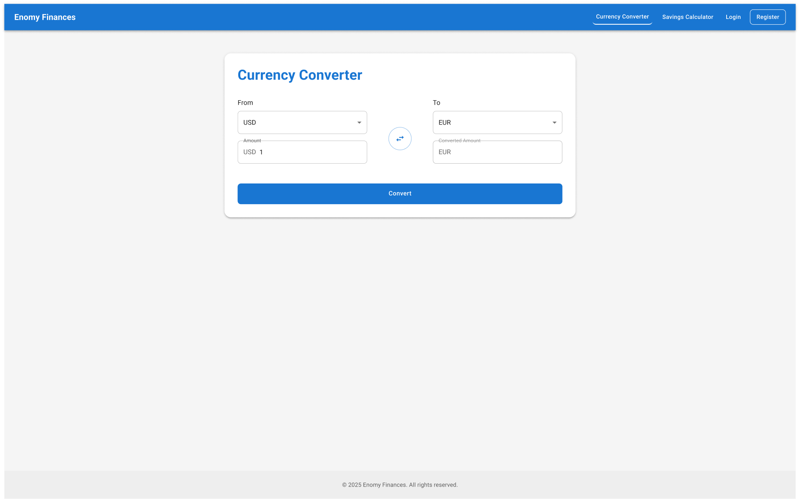

# Enomy-Finances React App

> Replace `link-to-screenshot-1.png` and `link-to-screenshot-2.png` with actual URLs or paths to your screenshots.

## Project Description

Enomy-Finances is a React application designed to help users manage their finances through currency conversion and investment calculation. It provides a user-friendly interface for:

-   **Currency Conversion:** Converts amounts between different currencies using real-time exchange rates. Users can select source and target currencies, enter the amount, and get the converted value instantly.
-   **Investment Calculation:** Calculates the future value of an investment based on initial investment, interest rate, compounding frequency, and investment duration. This tool helps users estimate potential returns on their investments.

This project leverages React for the front-end and Firebase for backend services like authentication and data storage.

## Firebase Configuration

To connect the application to Firebase, you need to set up a Firebase project and configure the app with your project credentials.

1.  **Create a Firebase Project:**
    -   Go to the [Firebase Console](https://console.firebase.google.com/).
    -   Click "Add project" and follow the instructions to create a new project.

2.  **Configure Firebase Web App:**
    -   In your Firebase project, click the web icon (`</>`) to add a new web app.
    -   Register your app with a nickname (e.g., "Enomy-Finances").
    -   Follow the instructions to add the Firebase SDK to your app. You'll receive a configuration object.

3.  **Set Environment Variables:**
    -   Create a `.env` file in the root of your project.
    -   Add the following environment variables, using your Firebase project's configuration values:

4.  **Initialize Firebase in Your App:**
    -   In your `src/firebase.js` (or similar) file, initialize Firebase using the configuration:

javascript
    // Import the functions you need from the SDKs you need
    import { initializeApp } from "firebase/app";
    // TODO: Add SDKs for Firebase products that you want to use
    // https://firebase.google.com/docs/web/setup#available-libraries

    // Your web app's Firebase configuration
    const firebaseConfig = {
      apiKey: process.env.REACT_APP_FIREBASE_API_KEY,
      authDomain: process.env.REACT_APP_FIREBASE_AUTH_DOMAIN,
      projectId: process.env.REACT_APP_FIREBASE_PROJECT_ID,
      storageBucket: process.env.REACT_APP_FIREBASE_STORAGE_BUCKET,
      messagingSenderId: process.env.REACT_APP_FIREBASE_MESSAGING_SENDER_ID,
      appId: process.env.REACT_APP_FIREBASE_APP_ID,
      measurementId: process.env.REACT_APP_FIREBASE_MEASUREMENT_ID
    };

    // Initialize Firebase
    const app = initializeApp(firebaseConfig);

    export default app;
    Runs the app in the development mode. This script starts the development server, allowing you to preview and test your application in a local environment.

Open [http://localhost:3000](http://localhost:3000) to view it in the browser.

The page will reload if you make edits. Any linting errors will be displayed in the console, helping you maintain code quality. Use this script during active development.

### `npm test`

Launches the test runner in the interactive watch mode. This script executes your application's unit tests, integration tests, or any other tests you have set up. The "watch mode" automatically re-runs tests when it detects changes to your code.

See the section about [running tests](https://facebook.github.io/create-react-app/docs/running-tests) for more information.

### `npm run build`

Builds the app for production to the `build` folder. This script compiles your React code, optimizes it for performance, and bundles it into static files ready for deployment.

It correctly bundles React in production mode and optimizes the build for the best performance, including minification and creating hashed filenames for caching.

Your app is ready to be deployed!

See the section about [deployment](https://facebook.github.io/create-react-app/docs/deployment) for more information.  Use this script when you are ready to deploy your application to a hosting provider.

### `npm run eject`

**Note: this is a one-way operation. Once you `eject`, you can’t go back!**

If you aren’t satisfied with the build tool and configuration choices, you can `eject` at any time. This command will remove the single build dependency from your project and copy all the configuration files (webpack, Babel, ESLint, etc.) and transitive dependencies into your project, giving you full control.

All commands except `eject` will still work, but they will point to the copied scripts, allowing you to tweak them. At this point, you are on your own. This is generally not recommended unless you have advanced configuration needs.

You don’t have to ever use `eject`. The curated feature set is suitable for small and middle deployments, and you shouldn’t feel obligated to use this feature. However, we understand that this tool wouldn’t be useful if you couldn’t customize it when you are ready for it.

## Project File Structure

enomy-finances/
├── node_modules/
├── public/
│   ├── index.html
│   └── ...
├── src/
│   ├── components/          # Reusable React components
│   │   ├── CurrencyConverter.tsx
│   │   ├── InvestmentCalculator.tsx
│   │   └── ...
│   ├── pages/               # Different pages of the application
│   │   ├── Home.tsx
│   │   ├── About.tsx
│   │   └── ...
│   ├── App.tsx              # Main application component
│   ├── index.tsx            # Entry point of the application
│   ├── firebase.js          # Firebase configuration
│   ├── styles/              # CSS or styling files
│   │   ├── global.css
│   │   └── ...
│   ├── App.test.tsx         # Application tests
│   └── ...
├── .env                     # Environment variables
├── package.json
├── README.md
└── ...
-   `src/components`: Contains reusable React components used throughout the application, such as the `CurrencyConverter` and `InvestmentCalculator`.
-   `src/pages`: Contains different pages or views of the application, like the `Home` and `About` pages.
-   `src/App.tsx`: The main application component that ties everything together.
-   `src/firebase.js`: Handles the initialization and configuration of Firebase.
-   `.env`: Stores sensitive information such as API keys and Firebase configuration.

## Dependencies

Besides the default dependencies included with Create React App, this project uses the following:

-   `@emotion/react`: "^11.11.1"
-   `@emotion/styled`: "^11.11.0"
-   `@mui/icons-material`: "^5.14.19"
-   `@mui/material`: "^5.14.20"
-   `axios`: "^1.6.2"
-   `firebase`: "^10.7.1"
-   `jwt-decode`: "^4.0.0"
-   `react-router-dom`: "^6.20.1"
-   `recharts`: "^2.10.3"

> Run `npm install` to install all dependencies.

## Contributing

We welcome contributions to the Enomy-Finances project! Here’s how you can contribute:

1.  **Fork the repository:** Create your own fork of the project on GitHub.
2.  **Create a branch:** Create a new branch for your feature or bug fix. `git checkout -b feature/your-feature-name`
3.  **Make changes:** Implement your changes and ensure the code follows the project's coding standards.
4.  **Test your changes:** Run tests to ensure your changes haven't introduced any regressions.
5.  **Commit your changes:** Write clear and concise commit messages.
6.  **Push to your fork:** Push your branch to your forked repository. `git push origin feature/your-feature-name`
7.  **Create a pull request:** Submit a pull request to the main repository, explaining your changes and their purpose.

Please adhere to the existing coding style and conventions.  All contributions are subject to review.

## License

This project is licensed under the [MIT License](LICENSE) - see the `LICENSE` file for details.

## Author/Maintainer

-   [Your Name](Your GitHub Profile)

> Replace `Your Name` and `Your GitHub Profile` with your actual name and GitHub profile URL.  Also, create a LICENSE file and add the appropriate license information.
